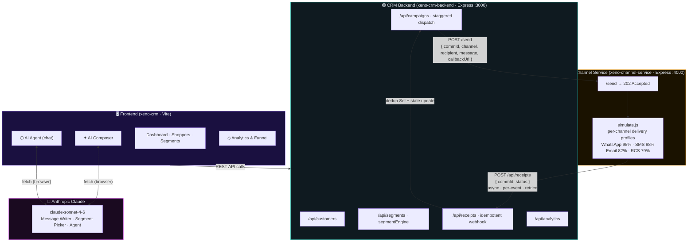

# Xeno — AI-Native Mini CRM

> Engineering take-home assignment submission by **Jagadeesh Muralidharan**

A full AI-native Mini CRM for helping D2C brands reach their shoppers intelligently — with behavioral segmentation, AI-powered campaign composition, an async channel service simulation, and a conversational AI agent.

---

## Quick Start

```bash
# 1. Install dependencies
npm install

# 2. Start dev server (opens at http://localhost:3000)
npm run dev

# 3. Build for production
npm run build
```

---

## Project Structure

```
xeno-crm/
├── index.html                  # Entry point
├── vite.config.js              # Vite config
├── package.json
├── public/
│   └── favicon.svg
└── src/
    ├── main.js                 # App bootstrap, state, routing
    ├── styles/
    │   └── main.css            # Full design system
    ├── data/
    │   └── shoppers.js         # 60 shoppers, segments, campaign factory
    ├── utils/
    │   ├── channelService.js   # Async stub channel + receipt callbacks
    │   ├── aiService.js        # Anthropic API + smart fallback responses
    │   └── ui.js               # Badges, avatars, notifications, modals
    └── components/
        ├── Dashboard.js        # KPIs, pipeline viz, channel chart
        ├── Pages.js            # Shoppers, Segments, Campaigns, Analytics
        └── Composer.js         # AI Composer, AI Agent, modals
```

---

## Features

| Feature | Description |
|---|---|
| **Data Ingestion** | Upload CSV with AI auto-mapping; 60 seeded shoppers pre-loaded |
| **Segmentation** | 6 behavioral segments + AI Segment Builder (natural language) |
| **Campaigns** | Full lifecycle — draft → send → delivery → receipts |
| **Channel Service** | Async stub fires delivery/open/click/convert callbacks with realistic delays |
| **AI Composer** | Claude writes high-converting messages from your goal description |
| **AI Agent** | Conversational interface for natural language campaign orchestration |
| **Analytics** | Conversion funnel, revenue chart, performance matrix — all live |

---

## AI Features

The AI features work in two modes:

1. **Without API key** — Smart fallback responses that are data-aware (references real segment sizes and campaign revenue from live state)
2. **With API key** — Paste your Anthropic API key into the 🔑 field in AI Composer or AI Agent to enable live Claude responses

---

## System Architecture

This frontend is one of **three services** in the submission:

| Repo | Role |
|---|---|
| **[xeno-crm](https://github.com/gaayathri-code-monk/xeno-crm)** | Vite frontend — AI Composer, Agent, live dashboard |
| **[xeno-crm-backend](https://github.com/gaayathri-code-monk/xeno-crm-backend)** | Express CRM API — campaigns, segments, receipts webhook |
| **[xeno-channel-service](https://github.com/gaayathri-code-monk/xeno-channel-service)** | Stub channel — simulates async delivery + fires callbacks |



### Key Design Decisions

| Decision | Implementation | At Scale |
|---|---|---|
| **Async callback loop** | Channel service fires POST to `/api/receipts` after random delay | Real provider webhooks (Twilio, WhatsApp Business API) |
| **Idempotent receipts** | `Set<commId:status>` deduplicates replays | Redis `SETNX` |
| **Staggered dispatch** | 70ms gap between messages to channel service | SQS FIFO + token-bucket producer |
| **Immediate 202 on /send** | Channel service never blocks CRM | Enqueue to async worker |
| **ACK before DB write** | `/api/receipts` responds before applying state | Kafka offset commit post-process |
| **Declarative segment filters** | `{ minSpend, minOrders, maxDaysSinceLast }` objects | Compile to SQL `WHERE` clause |

---

## Deployment

```bash
npm run build
# Drag the /dist folder to netlify.com/drop for instant hosting
```

---

## Tech Stack

- **Vite** — build tool and dev server
- **Vanilla JS (ES Modules)** — no framework overhead
- **Chart.js** — channel delivery and revenue charts
- **Anthropic claude-sonnet-4-6** — AI message composition and agent
- **Inter** — typography

---

*Built by Jagadeesh Muralidharan for the Xeno FDE Assignment, June 2026*
